# IAM

- One IAM user per PHYSICAL PERSON
- One IAM Role per APPLICATION
- A role does not have standard long-term credentials such as a password or access keys associated with it. Instead,  
it provides you with temporary security credentials for your role session.
- IAM permissions are across all regions.

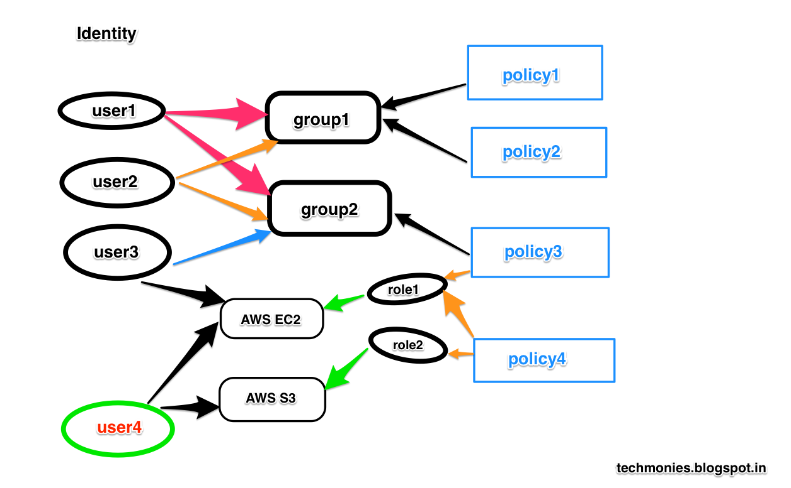

- A EC2 instance can be attached to a IAM role. Using this role we can trigger AWS cli commands from a EC2 instance
    
        Inline-Policy : Policy specific for a Role
        Global Policy : Policy which can be attached to any role’s

Check whether policy works using either CLI (dry run) or using the below Policy Simulator 
https://docs.aws.amazon.com/IAM/latest/UserGuide/access_policies_testing-policies.html
https://policysim.aws.amazon.com/home/index.jsp?#roles/dev-EC2DefaultServerRole

# VPC 
- VPC are per Account per Region
- Subnets are per VPC per AZ (Availability zone)
- Amazon VPC is the networking layer for Amazon EC2
- A subnet is a range of IP addresses in your VPC
- A route table contains a set of rules, called routes, that are used to determine where network traffic is directed
- An internet gateway is a horizontally scaled, redundant, and highly available VPC component that allows communication between instances in your VPC and the internet. It therefore imposes no availability risks or bandwidth constraints on your network traffic.
- NAT gateway allows instances within a private subnet access to the internet, but the NAT gateway itself will block all incoming requests from the internet. NAT is always inside public subnet

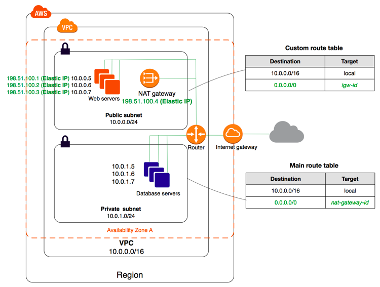

# EC2

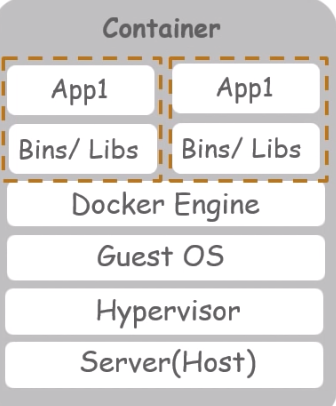
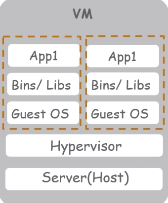

https://ec2instances.info/

- Amazon Elastic Compute Cloud is a web service. 
- Key Pair gives access to ssh into the EC2 instance
- Security Groups set the PORTS which are open for the EC2 instance

    * Can be attached to multiple instances
    * An instance can have multiple security groups
    * Locked down for a region/VPC
    * Like a Firewall outside the EC2 instance
    * While doing a SSH we cannot use private IP because we are not on the same network, but if we use VPN we can do it.
    * We can allow traffic coming from certain other Security groups. ie. use a security group inside another.

            Using 169.254.169.254 IP we can request any MetaData of an EC2 instance after ssh into it without any IAM Policies being attached

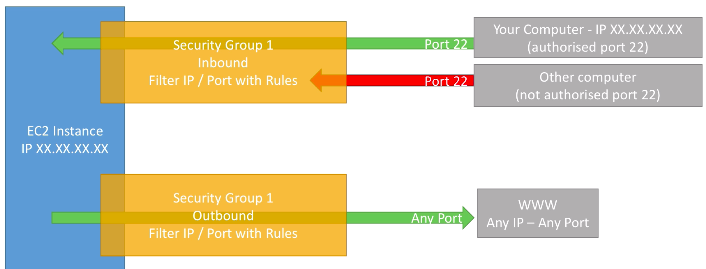
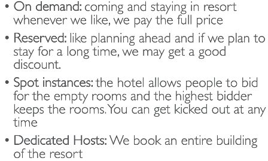
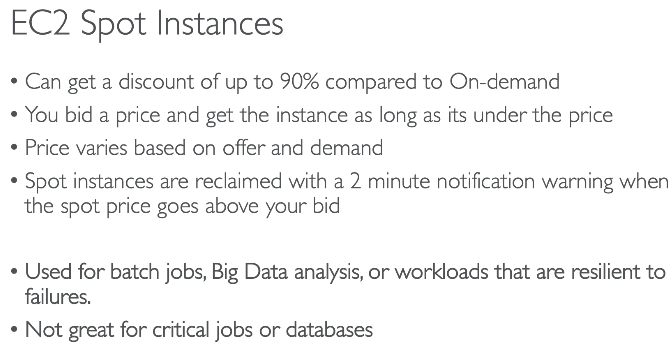

- Public IP can be identified on the internet and will be unique across the whole web
- Elastic IP is a public IPv4 IP. It can be attached to any one instance at a time.
- Whenever EC2 instance is restarted the public IP changes but the private IP remains the same
- Bootstrapping means launching commands when machine starts. EC2 user data is used to automate boot tasks. Shell script is added in user data.
- It is possible to have a custom Amazon Machine Image (AMI) to enhance the OS. AMI is built for a specific AWS region.
- EC2 machine loses its root volume when it is manually terminated. 
- An EBS (Elastic Block Store) volume is network drive you can attach to your instances while they run.
    - Its a network drive which uses network to communicate with the instance ( means latency involved ).
    - It can be detached and reattached to another EC2 instance
    - It is locked to AZ

# ECR
ECR Amazon Elastic Container Registry is a fully-managed private Docker Image repository that makes it easy for developers to store, manage, 
and deploy Docker container images. Similar to Docker Hub.
- Access controlled through IAM.
- Create a ECR instance in AWS web console and follow the commands specified to push the docker image to ECR
- ECR image scanning helps in identifying software vulnerabilities in your container images. Amazon ECR uses the Common Vulnerabilities and Exposures (CVEs) database from the open source CoreOS Clair project and provides you with a list of scan findings.

# ASG
Auto Scaling Group (ASG) adds or removes EC2 instances to match an increased or decreased load based on CloudWatch Alarms it is possible to scale an ASG

`Launch Configurations & Launch Templates` - When ever an ASG is created we get 2 options ie. Launch Configurations or Launch Templates. They specify the attributes that your Auto Scaling group uses to launch instances. These also hold the information of ECS cluster to which the 
EC2 instance will belong.

# ECS
Amazon Elastic Container Service container orchestration service that supports Docker containers and allows you to easily run and scale containerized applications on AWS

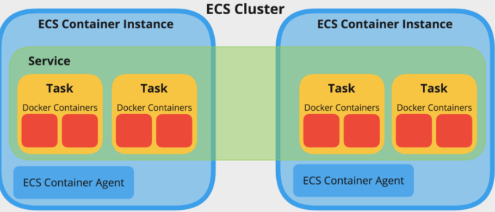

`Cluster` - While creating cluster we create EC2 instance and also specify the no. of instance. Cluster are logical grouping of EC2 instances
When a Cluster is created, it creates Auto Scaling Group (ASG) & Launch Configurations. This is configured via launch configurations or launch templates.
By default this EC2 instance will have amazon-ecs-agent docker container inside it. This is responsible for registering the instance to cluster.
We don't have to manually specify any link between EC2 instance and Task or Service. That is taken care automatically.

`ECS Tasks`  - JSON form which tells ECS how to run a docker Container. Contains Docker Image name, port binding container & host,
Memory, CPU, EBS volume, Env variables etc. Contains an IAM role. When ever we update a Task definition we create New revision of Task.

`ECS Service` - Define how many tasks should run and how they should be run. Service type can be REPLICA or DEAMON. If REPLICA
then we can specify the no. of tasks to be run for that service. If DEAMON it will run one task on each EC2 instance in our cluster.
One service can have only one Task definition, but it can run multiple instance of same Task. 
- While running multiple instances of a 
Task definition in a EC2, we need to have multiple EC2 instances as each instance will have only one port no. which is specified in the Task definition. 
Or else we have to remove the port no. from Task definition and use a load Balancer which can point to dynamically created port no.’s as part 
of multiple Task docker instance. 
- Load Balancer can be attached to Service only during the service creation.
To delete a service first make the Tasks 0 and then delete the service.
- Security groups are instance level and not task level.
- CloudWatch logs are setup at Task definition level. 

`AWS Fargate` - With Fargate we don’t have to create EC2 instances, we just create task definitions and AWS will create & run containers for us

https://docs.aws.amazon.com/AmazonECS/latest/developerguide/tutorial-cluster-auto-scaling-console.html
https://docs.aws.amazon.com/AmazonECS/latest/developerguide/cluster-auto-scaling.html
https://docs.aws.amazon.com/cli/latest/reference/ecs/run-task.html

`ECS Cluster Auto Scaling (CAS)` - manage the scaling of EC2 Auto Scaling Groups (ASG). You can configure ECS to scaling policy that scale it ASG automatically. CAS relies on ECS capacity providers, which provide the link between your ECS cluster and the ASGs you want to use. 
Each capacity provider has only one ASG, but many capacity providers can be associated with one ECS cluster. 
- The Tasks that don’t get 
placed on an instance because of insufficient resources which would fail earlier now will go into the provisioning state as far as managed 
scaling for the capacity provider is  enabled. 
- The tasks that move to provisioning state are queued and wait for instances to become available.
- Scaling policy uses a new CloudWatch metric called CapacityProviderReservation that ECS publishes for every ASG capacity provider that has managed scaling enabled. This metric controls the number of instances in the ASG, while also allowing 
other scaling policies to work with the ASG. 
- If Target capacity 100% means Target tracking value is 100%. If Target tracking metric == Target tracking value -> no scale out or scale in

# RDS

- Encryption at rest capability with AWS KMS / AES-256 encryption
- Read Replicas for improved performance 
- Multi AZ setup for Disaster Recovery
- Horizontal and vertical scaling capability 
- RDS instance identifier should be unique across the region
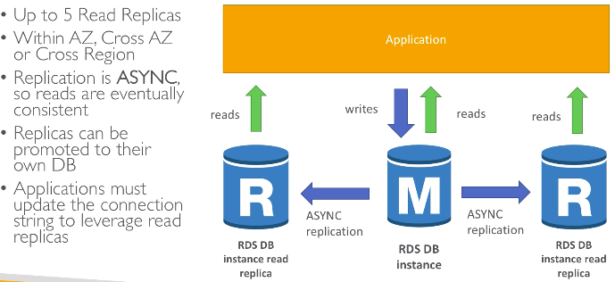
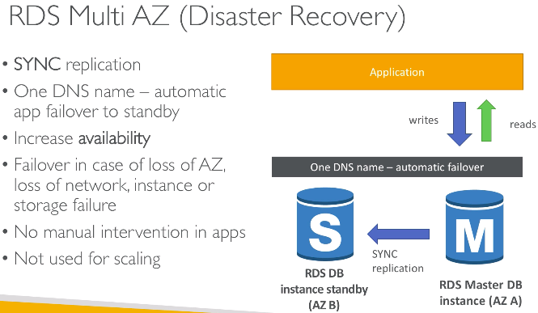

# ElasticCache
- Managed Redis or Memcache. In-memory databases with high performance, low latency, instead of relying entirely on slower disk-based databases.
- Write scaling using sharding
- Read scaling using Replicas 
- User session store Architecture - User logs into a application in a android phone, a session is created in the ElasticCache 
user hits another instance of the application, the session is retrieved from ElasticCache.
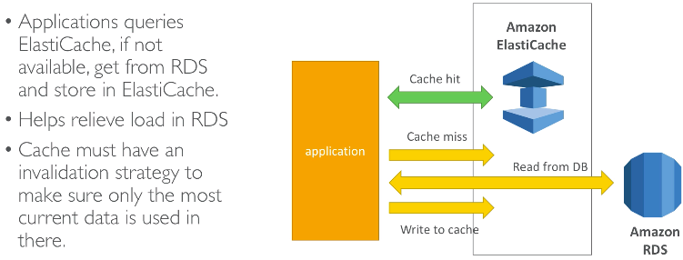

Two patterns for ElasticCache
- `Lazy Loading` - Load only the data which was requested previously. As a result of which we end up in cache miss, which has 3 interactions having 
read penalty
- `Write Through` - All the data in RDS is loaded in cache. Every write into RDS also write to cache. We end up in write penalty

# S3
- Buckets must have globally unique name
- Buckets are defined at the region level
- There is no concept of directories within buckets. Just that every object will have a key which is the full path.
- Bucket level versioning is available. Every time we update/delete a file, it makes a new version of it. At any point any old version can be downloaded

# AWS GLUE
AWS Glue consists of a central metadata repository known as the AWS Glue Data Catalog, an ETL engine that automatically generates Python or Scala code, and a flexible scheduler that handles dependency resolution, job monitoring, and retries. 
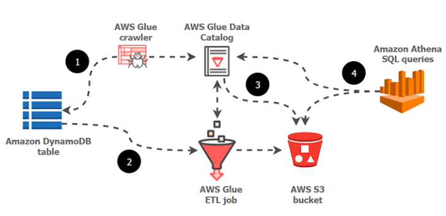
- AWS Glue is serverless.
- Glue provides pyspark jobs to be run rather than python scripts
- Crawlers - set the S3 path where the data source reside and trigger crawl command
- Database & Tables - Schema for the datasource will be crawled and setup under Data Catalog

# AWS Athena
Interactive query service that makes it easy to analyze data in Amazon S3 using standard SQL. Athena is serverless, so there is no infrastructure to manage, and you pay only for the queries that you run.

Athena is out-of-the-box integrated with AWS Glue Data Catalog, allowing you to create a unified metadata repository across various services, 
crawl data sources to discover schemas and populate your Catalog with new and modified table and partition definitions, and maintain schema versioning

`Schema-on-Read` - We apply schema only during read operations at the serving layer. The data 
Resides in a data lake as csv or parquet. Athena fetches these raw data and applies 
Schema on it and help in doing a query on the data.

# AWS SageMaker
covers the entire machine learning workflow to  prepare your data, choose an algorithm, train the model, 
tune and optimize it for deployment, make predictions, and take action.
Provide Jupyter Notebook

> Create Training job by providing 
* URL of S3 where data is stored 
* compute resources that is required to run the job
* URL of S3 where output is to be stored
* ECR docker path where the training code is stored
    
> Deploy the model where HTTPS endpoint is available 

Data Analysis, Model Training, Model deployment is all done via code in the same Jupyter Notebook

`AWS SageMaker AutoPilot` - AutoML

`SageMaker Examples` - Provide different optimised algorithms and sample code template that is configured in Notebooks.
`Training Jobs using SageMaker Algorithms` - Provide compute resource, output bucket. Set Hyperparameter tuning 
`LifeCycle Configurations` - Add any script to be run during the start of instance. Eg: pip install of packages 

# AWS Cloud Map
Cloud resource discovery service. With Cloud Map, you can define `custom names` for your application resources, and it 
maintains the updated location of these dynamically changing resources.
- Domains are configured here.
- Cloud Map allows you to register any application resources, such as databases, queues, microservices, and other cloud resources, 
with custom names. 
- Cloud Map then constantly checks the health of resources to make sure the location is up-to-date. 
- The application can then query the registry for the location of the resources needed based on the application version 
and deployment environment.

# CloudWatch & CloudTrail
`CloudWatch` is a general purpose monitoring and management platform for AWS resources.  One of the most common use cases is to ship various log streams from sources like EC2 instances to CloudWatch Logs, and then configure a monitor to watch for certain patterns in the stream.  From there, you can set up alerting for those conditions and graphing for visualization.
- CloudWatch Alarms 
- CloudWatch Events
- CloudWatch Insights - Can run queries on any log groups.
- Eg: filter @message like /(?i)(Exception|error|fail)/

`CloudTrail` provides a log of changes to the AWS infrastructure.  It might be used to fulfill some of the auditing requirements of the HIPAA Security Rule, but it is also a good place to keep track of any AWS resource changes when multiple developers are involved.

# AWS CICD
- `AWS CodeCommit` is a fully-managed version control that makes it easy for companies to host secure and highly 
scalable private Git repositories. Repos are automatically encrypted at rest using KMS. Triggers are used code related events pushing branch,
deleting or creating branch. Notifications are used for PR events.
- `AWS CodePipeline` is a continuous integration and continuous delivery service for fast and reliable application and infrastructure updates. 
CodePipeline builds, tests, and deploys your code every time there is a code change
    - Action Group - A small unit of action like build. Action groups can be parallel or sequential  
- `AWS CodeBuild` is a fully managed continuous integration service that compiles source code, runs tests, and 
produces software packages that are ready to deploy. CodeBuild scales continuously without us managing any servers and processes multiple builds concurrently. Build Instructions are defined in buildspec.yml file which is placed at the root of the code
- `AWS CodeDeploy` is a fully managed deployment service that automates software deployments to compute services such as Amazon EC2, AWS Lambda, and your on-premises servers

# AWS QuickSight
utility that allows a company to create and analyze visualizations of its customers' data. The business intelligence service 
uses AWS' `Super-fast, Parallel, In-memory Calculation Engine (SPICE)` to quickly perform data calculations and create graphs
- Dashboards can then be accessed from any device, and embedded into your applications, portals, and websites.
Need to register a user separately under QuickSite and provides a monthly or yearly subscription.
- Uses Auto-Graph which suggests what visualisation to be used based the selected data fields
- Super-fast Parallel In-memory Calculation Engine - SPICE. Cache layer which stores the data from any selected Data source

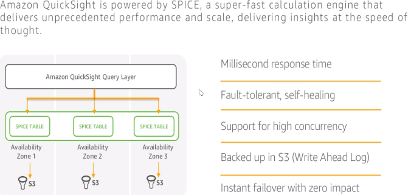
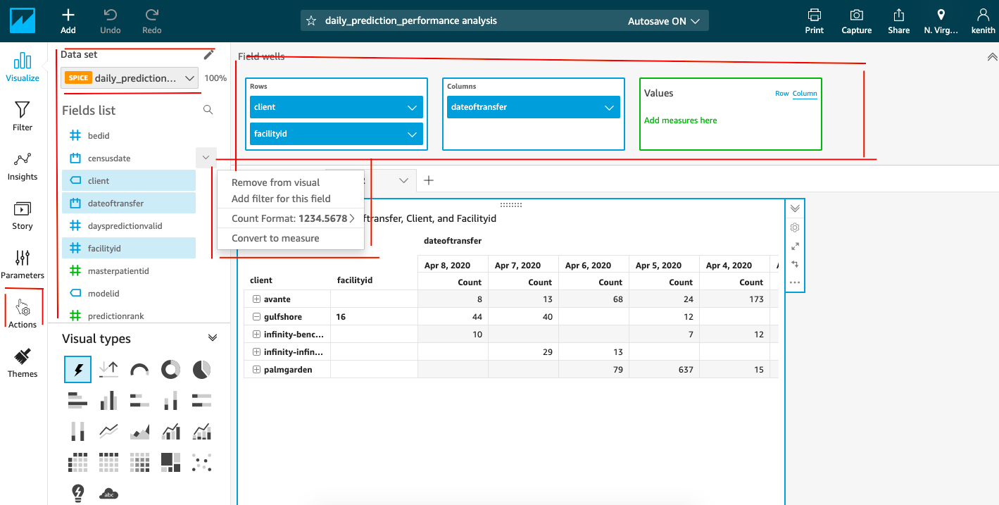
