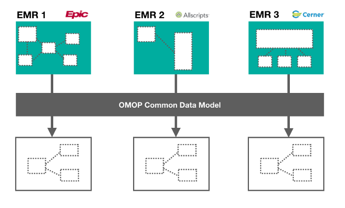
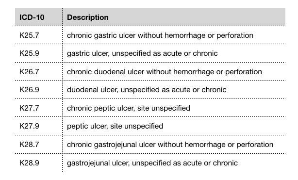
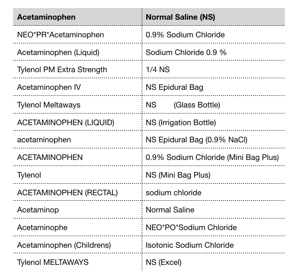
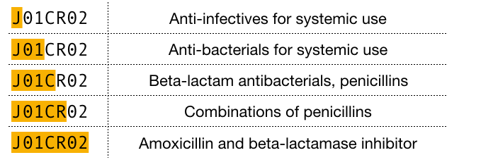
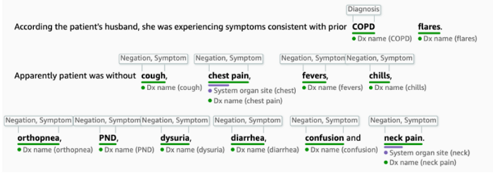

# Feature Engineering of Electronic Medical Records
`A comprehensive overview of data cleaning and feature engineering techniques for clinical data
Jill Cates
Jill Cates
Oct 5, 2019·11 min read
`

This article is cross-posted on the BioSymetrics website. To see the original post, check out the BioSymetrics <a href='https://www.biosymetrics.com/#biosym-blog-hp'>blog</a>.

- The electronic medical record (EMR) is a digital version of a patient’s chart that collects data related to a patient’s visit such as past medical history, lab results, prescriptions, diagnosis, and patient reported outcomes. EMR data are notorious for being messy, incomplete, and inconsistent. Part of the “messiness” is due to the diverse nature of clinical data. A typical EMR consists of disparate datatypes including:
    -   unstructured text (e.g., clinical notes)
    -   2D and 3D images (e.g., X-ray, MRI, fMRI)
    -   time-series signals (e.g., ECG and EEG traces)
    -   PDFs with text (e.g., lab reports)
In this post, we will walk through several techniques for cleaning clinical data and engineering features from an EMR database.

# Data Standardization
The first step of the data cleaning process is data standardization. Let’s say we are working with data stored on multiple EMRs. While interoperability standards ensure that there is consistency in patient record content, there is no official standard for how this content gets stored, which means that each EMR can have its own data schema. A recent report has estimated that a single hospital network will have on average 16 different EMR platforms in use at its affiliate institutions [1]. In order to analyze data across disparate EMR platforms, we need to transform it into a common format.

The Observational Medical Outcomes Partnership Common Data Model (OMOP-CDM) is a framework that can help harmonize disparate data into a standardized format [2]. OMOP-CDM was developed by a group of international researchers coordinated through Columbia University, with the intention of developing a standard to facilitate reproducible research. It can be broken down into two steps:

1.  `Transforming the data schema into a standard format:` Data should be wrangled into OMOP-CDM which consists of 15 clinical data tables. Some of these tables include PERSON (containing demographic information about the patient), OBSERVATION_PERIOD (containing timestamp of patient’s visit to the physician), and DRUG_EXPOSURE (containing prescription and over-the-counter medicines, vaccines, and large-molecule biologic therapies). For a detailed outline of the OMOP-CDM schema, you can check out the official wiki here.
2. `Mapping content to standardized vocabularies:` There are numerous ways to describe a clinical event. To map medical jargon to standardized vocabularies, the OMOP-CDM makes use of the U.S. National Library of Medicine’s Unified Medical Language System (UMLS) which contains medical ontologies such as SNOMED, RxNorm, ICD10, and LOINC.

This process can involve extensive manual data wrangling depending on how diverse the data structures are. To learn more about how to standardize EMR data using OMOP, check out this <a href='https://github.com/OHDSI/CommonDataModel'>Github repo.</a>

# Diagnosis Codes
International Statistical Classification of Diseases, also known as ICD, is a classification system developed by the World Health Organization that is used for describing patient diagnosis. At the end of a patient’s hospital stay, a list of ICD codes are assigned to that particular hospital admission, which ultimately gets used for reimbursement purposes. There are two versions of ICD:
1. ICD-9, which is now deprecated, contains 13,000 diagnosis codes.
2. ICD-10 contains 68,000 diagnosis codes and is considered the gold standard for classifying patient diagnoses. There are resources available for converting ICD-9 codes to ICD-10.

Let’s say we’re building a clinical diagnosis model and we want to include “diagnosis” as a feature. Using the raw format of ICD codes, we would have a very sparse high-dimensional dataset, with each column representing a unique ICD code. To reduce data dimensionality, we can categorize ICD codes into a smaller subset of well-defined comorbidities using the Charlson and Elixhauser comorbidity mappings. Charlson collapses ICD codes into 17 comorbidites, while Elixhauser groups codes into 30 comorbidities. A complete list of Elixhauser and Charlson comorbidity categories can be found below:

- `Charlson:` myocardial infarction, congestive heart failure, peripheral vascular disease, cerebrovascular disease, dementia, chronic pulmonary disease, rheumatic disease, peptic ulcer disease, mild liver disease, diabetes without chronic complication, diabetes with chronic complication, Hemiplegia/paraplegia, renal disease, any malignancy, moderate/severe liver disease, metastatic solid tumour, AIDS/HIV
- `Elixhauser:` congestive heart failure, cardiac arrhythmia, valvular disease, pulmonary circulation disorders, peripheral vascular disorders, hypertension (uncomplicated), hypertension (complicated), paralysis, other neurological disorders, chronic pulmonary disease, diabetes (uncomplicated), diabetes (complicated), hypothyroidism, renal failure, liver disease, peptic ulcer disease, AIDS/HIV, lymphoma, metastatic cancer, solid tutor without metastasis, rheumatoid arthritis, coagulopathy, obesity, weight loss, fluid and electrolyte disorders, blood loss anemia, deficiency anemia, alcohol abuse, drug abuse, psychoses, depression

Here’s an example of ICD-10 codes that fall under “peptic ulcer disease” as defined by Elixhauser’s comorbidity mapping:

By mapping hyper-specific ICD diagnosis codes into well-defined comorbidities, we are reducing the dimensions of our dataset which effectively reduces noise and complexity. Several studies have suggested that the Elixhauser comorbidity measure has better predictive ability of patient outcome than Charlson [<a href='https://journals.lww.com/lww-medicalcare/Abstract/2004/04000/Comparison_of_the_Elixhauser_and_Charlson_Deyo.8.aspx'>3</a> <a href='https://link.springer.com/article/10.1007/s11999-014-3686-7'>[4]</a> <a href='https://acsjournals.onlinelibrary.wiley.com/doi/full/10.1002/cncr.25653'>[5]</a> 

# Medication Data
Free-text fields allow for rapid data entry by the physician. However, this type of unstructured data entry can lead to spelling errors and variations in abbreviations, which makes it difficult to analyze patient data. Prescription drugs are not always recorded in a standardized format in a patient’s record. There can be variability in naming convention across clinicians. For example, the blood thinning drug Warfarin can also be referred to as Coumadin. Acetaminophen, a common pain reliever drug, is also known by its brand name Tylenol. Intravenous normal saline, which is often administered to patients in the ICU, may be recorded as NS which stands for normal saline, or by its chemical description 0.9% sodium chloride. An example of the many variations of drug names is illustrated in the table below. Spelling variations of acetaminophen and normal saline

## Normalizing Drug Names
If we want to incorporate prescription drugs as a feature in our model, we need to find a way to map drugs into a universal nomenclature. Two options for standard drug nomenclature include:

1. `National Drug Codes (NDC):` NDC is a coding system consisting of 10 or 11 digits that uniquely identifies drugs approved by the U.S. Food and Drug Administration. All drugs in commercial distribution in the U.S. have a unique NDC. The NDC for 100 tablets of acetaminophen (Tylenol) is 69618–010–[01], while the NDC for 1000 tablets is 69618–010–[10]. The two NDCs are almost identical except for the last two digits.
2. `RxNorm:` RxNorm represents medications by 3 properties: 1) ingredients, 2) strength, and 3) dose form. It was developed by the U.S. National Library of Medicine because there was a need for standard representation of medications [6]. Each unique combination of ingredient, strength, and dose form has a common unique identifier called RxCUI. For example, Acetaminophen 500 MG Oral Tablet (Tylenol) is represented by RxCUI 209459. The RxCUI for the same medication, but in 325 MG strength, is 209387.

Though both nomenclatures are valid options for normalizing drug names, RxNorm appears to be more widely used than NDC for representing medications in a clinical context. Nelson et al. explains that NDC is less appealing because it contains very granular information about the manufacturer/packager which is generally not needed for clinical research [7]. Whichever nomenclature you decide to use, it’s important to make sure that drug names are normalized before proceeding to the feature engineering and modelling phase of your pipeline. To learn more about these drug nomenclatures, you can check out the RxNorm API which provides the RxCUI and NDC for a given drug, and also has other functionality such as returning spelling suggestions for a misspelled drug name.

# Extracting Features from Drugs
As part of our data mining step, we may want to reduce the dimensions of our drug dataset. To cluster drugs, we can extract properties using the National Institute of Health’s medical subject headings (MeSH). Let’s say we want to know whether the patient was prescribed an antibiotic, but we only have the drug name. We can get relevant attributes of a drug by looking at its MeSH terms. For example, the MeSH terms for Tylenol are “Anti-Inflammatory Agents, Non-Steroidal” and “Analgesics, Non-Narcotic”, while amoxicillin’s MeSH terms are “Anti-Bacterial Agents” and “beta-Lactamase Inhibitors”. With this approach, we can identify antibiotic drugs by filtering those with MeSH term “Anti-Bacterial Agents”.

Another strategy for grouping drugs is the World Health Organization’s Anatomical Therapeutic Chemical (ATC) drug classification system. The ATC classifies drugs at 5 different levels, including the organ or system on which the drug acts, their therapeutic use, and the chemical properties of the drug. Each component of a drug’s ATC code represents a specific property of that drug. For example, the ATC code for amoxicillin is J01CR02 which can be broken down into the following levels:

With the ATC approach, we can identify antibiotic drugs by filtering those that start with “J01”. There are open-source APIs available, such as RxNorm and OpenFDA, that you can use to supplement your drug data with MeSH terms and ATC properties.

# Clinical Notes

Clinical notes are a valuable source of information that can significantly improve the quality of a predictive diagnostic model. Ghassemi et al. found that clinical notes were the most meaningful data for improving prediction accuracy of in-hospital mortality [8]. Other studies have also reported a considerable improvement in model performance when using narrative text from clinical notes.

Since clinical notes are a form of unstructured data, we need to process this narrative text into structured features. Here, we will describe two natural language processing (NLP) techniques to generate structured data from unstructured text.

## Topic Modelling
Topic modelling is a type of unsupervised learning that clusters similar groups of documents together based on shared attributes. Its goal is to discover “hidden topics” from a collection of documents. Prior to applying topic modelling to your clinical notes dataset, it’s a good idea to do some text pre-processing using a technique called `term frequency-inverse document frequency (TF-IDF)`. Here, we consider a “word” to be a “term”. TF-IDF is a term-weighting metric that evaluates the importance of a word based on its frequency within in a document. The more often a word appears in a document, the higher the TF-IDF score. Words that appear more frequently in general get down-weighted based on the number of documents they appear in. Once you apply TF-IDF to your clinical notes dataset, you will get a document-term matrix of shape (n_docs, n_terms) where each cell represents the TF-IDF weighted score of a given term in a document. We can use this document-term matrix to train our topic model.
There are two different techniques that perform topic modelling:

- `Latent Dirichlet Allocation (LDA):` This probabilistic model is based on the assumption that 1) every document can be described by a mixture of topics weighted by probabilities, and 2) every topic is defined by a mixture of words <a href='https://www.jmlr.org/papers/volume3/blei03a/blei03a.pdf'>[9]</a>. LDA uses hierarchical Bayesian modelling to simultaneously estimate the mixture of words associated with each document, and find the mixture of topics that describes each document.
- `Non-negative Matrix Factorization (NMF):` This linear algebraic algorithm uses matrix factorization to generate latent topics from a document-term matrix. With NMF, the original matrix (n_docs, n_terms) gets factorized into two factor matrices: a document-topic matrix (n_docs, n_topics) and a topic-term matrix (n_topics, n_terms).

In both LDA and NMF, you need to define the number of topics that you want to generate. This hyperparameter can be tuned using metrics such as model perplexity and topic coherence to find the optimal number of topics that best suits the dataset at hand. If you’re using Python, take a look at gensim and scikit-learn libraries which both have modules for performing TF-IDF, LDA, and NMF.

## Named Entity Recognition Model
Named Entity Recognition (NER) classifies named entities from unstructured text into pre-defined categories such as persons, locations, organizations, and products. Some examples of relevant clinical named entities are symptom, diagnosis, medication, treatment, procedure, and anatomy. A patient’s medical history and presenting symptoms are typically described in the form of clinical notes, so NER is a useful tool for extracting patient-related features from this text.

If you’re looking to apply NER to unstructured text, there are several approaches to choose from: a rule-based approach (e.g., regular expressions), unsupervised learning (e.g., clustering), supervised learning (e.g., <a href='https://en.wikipedia.org/wiki/Conditional_random_field'>conditional random fields</a>), or deep learning (e.g., <a href='https://en.wikipedia.org/wiki/Long_short-term_memory'>long short-term memory</a>). spaCy is a useful open-source NLP package that implements NER using a deep learning technique involving residual convolutional neural networks (CNNs). Amazon (AWS) recently launched <a href='https://aws.amazon.com/comprehend/medical/'>Comprehend Medical</a>, which highlights key medical terms from clinical text using a biomedical-specific NER model. These off-the-shelf solutions are a great start to applying NER to your own dataset.

# Wrap Up
Machine learning has massive potential to enhance clinical decision-making and improve patient outcomes. A major barrier to applying machine learning in healthcare is the complex, unstructured nature of patient data. This post covers various tools and techniques for standardizing, cleaning, and extracting features from electronic medical records. These steps are a crucial part of the machine learning pipeline, and play an important role in building robust predictive diagnostic models.

# Take-Aways
- Electronic medical records are messy and need to be standardized, cleaned, and processed before being fed into a machine learning model.
- The OMOP Common Data Model is a framework for standardizing data from multiple EMRs into a common format.
- Charlson and Elixhauser comorbidity mappings help reduce diagnosis codes into well-defined comorbidity categories.
- RxNorm and NDC are two nomenclatures for normalizing drug names.
- MeSH and ATC are classification systems that can be used to extract properties from a given drug.
- Clinical notes contain valuable information about the patient but requires processing to convert unstructured text into structured features.
- Topic modelling is a text-mining technique that can be implemented in two ways (LDA and NMF) to help extract hidden topics from unstructured text.

#### Reference: https://medium.com/@topspinj/feature-engineering-of-electronic-medical-records-7447ee1c47b4