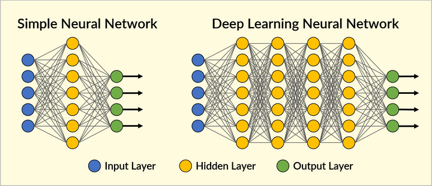
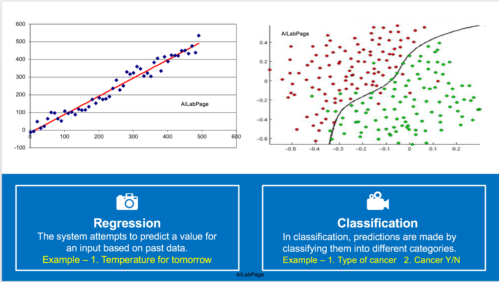
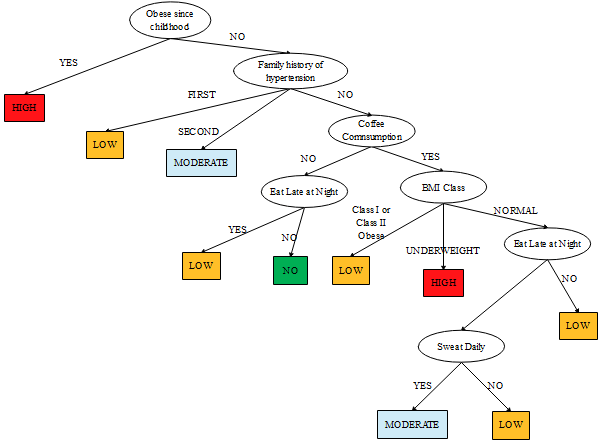

# What is Machine Learning ?

- Provide system's the ability to automatically learn and improve from experience without being explicitly programmed
- Eg: Imagine you are going to bowling and its your first day
- A computer program is said to learn from experience E with respect to some class of tasks T and performance measure P, if its performance at tasks in T, as measured by P, improves with experience E.

# Difference between ML & AI
- Artificial Intelligence is the broader concept of machines being able to carry out tasks in a 
way that we would consider “smart”.
- Machine Learning is a current application of AI based on the idea of feeding data & allow 
them learn for themselves

# Why ML or AI
- Applications learn from experience (well data) like humans without direct programming. When exposed to new data, these applications learn, grow, change, and develop by themselves. We don’t want to code the logic for our program instead we want a machine to figure out logic from the data on its own.

# Neural Network

Neural networks are a class of machine learning algorithms used to model complex patterns in datasets using multiple hidden layers and non-linear activation functions. They are based on the model of a human neuron.

- Neuron - it takes in some inputs and fires an output. In purely mathematical terms, a neuron in the machine learning world is a placeholder for a mathematical function, and its only job is to provide an output by applying the function on the inputs provided.The function used in a neuron is generally termed as an activation function

- A layer is nothing but a collection of neurons which take in an input and provide an output

# Types of ML

- Supervised ML:
    Supervised learning is where you have input variables (x) and an output variable (Y) and you use an algorithm to learn the mapping function from the input to the output Y = f(X)

- Reinforcement learning:
    A computer program interacts with a dynamic environment in which it must perform a certain goal (such as driving a vehicle or playing a game against an opponent). The program is provided feedback in terms of rewards and punishments as it navigates its problem space. Eg: autonomous driving, text summarization, question answering, and machine translation

- Semi-supervised learning:
    Problems where you have a large amount of input data and only some of the data is labeled, are called semi-supervised learning problems. Eg: photo archive where only some of the images are labeled

- Unsupervised machine learning:
    System is given a set data and tasked with finding patterns and correlations or relationships

# Regression & Classification

- Regression
    Systems where the value being predicted falls somewhere on a continuous spectrum. 

- Classification
    Inputs are divided into two or more classes

# Decision Trees

- Type of Supervised Machine Learning, where the data is continuously split according to a certain parameter
- Eg: Decision Tree formulated for Risk of Kidney stones

# Downside of ML

- Data Acquisition
- Time and Resources
- Explainability - Interpretation of Results
- High error-susceptibility - biased predictions, Overfitting, Underfitting

# Applications of ML & AI

- Do you know Facebook is using ML to tag your friends in your uploaded picture? Do you know Facebook shows custom video recommendations based on your interest history?
- Do you know how does gmail knows that a particular mail has to go to priority, social, promotion or spam box
- Healthcare - Medication predictions, disease identification or trajectory etc
- Businesses - efficiency of logistics and transportation networks, build customer profiles, increase sales and improve brand loyalty
- Education - Identify struggling students earlier and take action 
