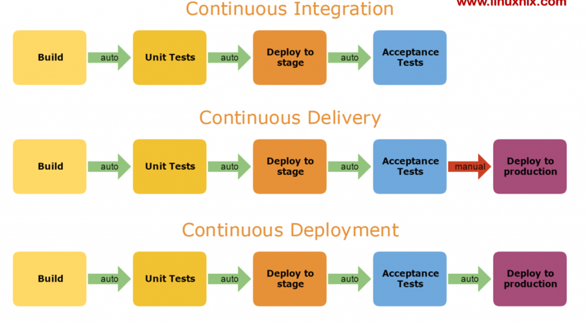

# What is CI/CD tools in DevOps?

CI/CD is a method to frequently deliver apps to customers by introducing automation into the stages of app development and visualized as a pipeline. The main concepts attributed to CI/CD are continuous integration, continuous delivery, and continuous deployment. 

# CI - continuous integration

Continuous integration is an automation process for developers. New code changes to an app are regularly built, tested, and merged to a shared repository. It’s a solution to the problem of having too many branches of an app in development at once that might conflict with each other. Every time a new PR is merged to the trunk, if automated testing discovers a conflict between new and existing code, CI makes it easier to fix those bugs quickly.

# CD - continuous delivery or continuous deployment

Continuous delivery usually means a developer’s changes to an application are automatically bug tested and uploaded to a repository (like GitHub or a container registry), where they can then be deployed to a live production environment by the operations team. It’s an answer to the problem of poor visibility and communication between dev and business teams. The purpose of continuous delivery is to ensure that it takes minimal effort to deploy new code.

Continuous deployment can refer to automatically releasing a developer’s changes from the repository to production, where it is usable by customers. Reduces manual processes that slow down app delivery. 

# Advantages
- Rapid delivery - Save lot of time in Integrations & deployment
- Early detection of bugs/exceptions using CI
- PR can be merged faster and more often
- Reduce human error 
- Configurable workflow

# Downside
- Lot of upfront investment interms of time and cost
- Automated tests need to be written to accommodate a variety of testing and release stages in the CI/CD pipeline
- Infrastructure cost 
- Require Devops Engineer who understands entire CI/CD  

# Common CI/CD tools

Beyond Jenkins and Tekton Pipelines, other open source CI/CD tools you may wish to investigate include:

- <a href='https://spinnaker.io/'>Spinnaker</a>, a CD platform built for multi-cloud environments.
- <a href='https://www.gocd.org/'>GoCD</a>, a CI/CD server with an emphasis on modeling and visualization.
- <a href='https://concourse-ci.org/'>Concourse</a>, "an open-source continuous thing-doer."

Public cloud providers who offer CI/CD solutions
- <a href="https://circleci.com/">CircleCI</a>
- <a href="https://aws.amazon.com/codepipeline/">CodeBuild,CodeDeploy,CodePipeline</a>
- <a href="https://about.gitlab.com/">GitLab</a>
- <a href="https://travis-ci.com/">Travis CI</a>
- <a href="https://www.atlassian.com/software/bamboo">Atlassian Bamboo</a>

Few tools for configuration management & application-deployment tool, enabling infrastructure as code. That means they are designed to deploy, configure and manage servers.
- <a href="https://www.ansible.com/">Ansible</a> 
- <a href="https://www.chef.io/">Chef</a> 
- <a href="https://puppet.com/">Puppet</a>
- <a href="/en/topics/containers/what-is-docker">Docker</a> 
- Container orchestration (<a href="/en/topics/containers/what-is-kubernetes">Kubernetes</a>) 