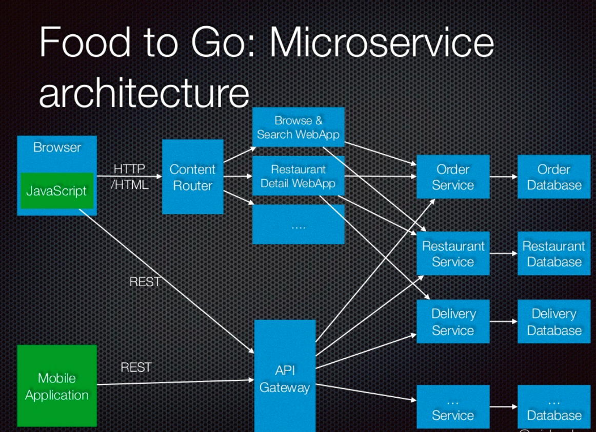

# <a href='https://microservices.io/'>Microservices</a>

## Problems
* [Monolithic backend]
  - Long-term commitment to a technology stack
  - Tight coupling between components, as everything is in one application.
  - Large code base; tough for developers and QA to understand the code and business knowledge.
  - The size of the application can slow down new feature additon, bug identification and start-up time ie. reduced agility
  - Does not follow SRP (Single Responsibility Principle)
  - When we have to scale a service ie. may be web request handling, in Monolith it can be scaled either vertically and horizontally. But lot of other services inside same monolith which does not need scaling consume resource unnessarily 
  - Code tends to quietly become more coupled over time
   
* [Multi-tenant system] 
  - Applies stress to the [All-Or-Nothing]
  - Small changes require entire project to be rebuilt and deployed

## Why & What are Microservices ?
* ### [Wikipedia][Microservices on Wikipedia]
  Services communicate using either synchronous protocols such as HTTP/REST or asynchronous protocols such as AMQP. Services can be developed and deployed independently of one another. Each service has its own database in order to be decoupled from other services. 

  Advantages:
  * Independently developed and deployed
  * Modular Structure where each service has 
    its own database in order to be decoupled 
    from other services
  * Enables Continuous Delivery. Each team can develop, test, deploy and scale their services independently
  * Application starts faster, which makes developers more productive, and speeds 
  up deployments
  * Scalable Architecture
  * Eliminates any long-term commitment to a technology stack
  * Fault in one service only gets only that service down
  * Small changes require only containing module to be rebuilt and deployed

* ### Monoliths versus Microservices

    ![Monoliths and Microservices]

  ### Characteristics of a Microservices Architecture

  * #### Componentization via Services

  * #### Organized around Business Capabilities

  * #### Single Responsibility Principle (SRP) 
    * defines a responsibility of a Microservice. And states that a service should only have one reason to change.
    * Another analogy that helps with service design is the design of Unix utilities

      ![Conways Law in Action]    
      
      `Any organization that designs a system will inevitably produce a design whose structure is a copy of the organization's communication structure`
      
      In "Exploring the Duality between Product and Organizational Architectures", a study by The Harvard Business School carried out an analysis of different codebases to see if they could prove Conway’s original hypothesis as applied to software systems. In it, they took multiple examples of software created to solve the same purpose (for example word processing, financial management and database software), and compared the code bases created by loosely-coupled open source teams, and those created by tightly-coupled teams. Their study found that the often co-located, focused product teams created software that tended more towards tightly-coupled, monolithic codebases. Whereas the open source projects resulted in more modular, decomposed code bases.
      
      Organizations for a few years now have understood this link between organizational structure and software they create, and have been embracing new structures in order to achieve the outcome they want. Netflix and Amazon for example structure themselves around multiple small teams, each one with responsibility for a small part of the overall system. These independent teams can own the whole lifecycle of the services they create.These services with their independent concerns can change and evolve separately from one another, resulting in the ability to deliver changes to production faster.

      ![Functional Staff Organization]

  * #### Decentralized Data Management
    * Let each Microservice manage its own data.

      ![Decentralized Data]

    * Make the separation of concerns explicit at the service level, not the database level.

  * #### Design for Failure
    * By separating out components across a network, we're adding more area for things to fail.
    
  * #### Evolutionary Design
    * Design to maximize independent replacement and upgradeability
    * Expect services to be scrapped or replaced rather than evolved

* ### Service Discovery in a Microservices
  
  * Client‑Side Discovery Pattern using service registry
  * Server‑Side Discovery Pattern using a Load Balancer and a service registry    

* ### Inter‑process communication (IPC)
  *  `Synchronous` – The client expects a timely response from the service and might even block while it waits. Eg: Request/response
  * `Asynchronous` – The client doesn’t block while waiting for a response. Eg: Pub-sub
  * `Asynchronous, Message‑Based Communication` - A client makes a request to a service by sending it a message. If the service is 
    expected to reply, it does so by sending a separate message back to the client.
    Eg: AMQP (Advanced Message Queuing Protocol).
  

* ### Best Practises
  * `Client directly calling different Micro-services is a bad approach.`
  Each Microservice might use different protocols that are not web friendly. Over time if we merge two services or split a service into two or more services performing this kind of refactoring 
    can be extremely difficult

  * `Circuit breaker pattern` – Track the number of successful and failed requests. If the error rate exceeds a configured threshold, trip the 
    circuit breaker so that further attempts fail immediately. If a large number of requests are failing, that suggests the service is unavailable 
    and that sending requests is pointless. After a timeout period, the client should try again and, if successful, close the circuit breaker.

  * `Limiting the number of outstanding requests` – Impose an upper bound on the number of outstanding requests that a client can have 
    with a particular service. If the limit has been reached, it is probably pointless to make additional requests, and those attempts need to 
    fail immediately.
  
  * `Use Service Discovery and API Gateway`

## Issues to keep in mind when using Microservices
* #### Versions and Regressions
  * You lose ability to easily know who depends on which version of microservice
  
* #### Microservices for the sake of Microservices
  * Keep in mind the problem you're trying to solve.
  

* ### Example Architecure of Online Food Delivery Application

 

<!-- External Links -->
[Microservices on Wikipedia]: https://en.wikipedia.org/wiki/Microservices (Wikipedia: Microservices)

<!-- Images -->
[Monoliths and Microservices]: https://martinfowler.com/articles/microservices/images/sketch.png (Monoliths and Microservices)
[Conways Law In Action]: https://martinfowler.com/articles/microservices/images/conways-law.png (Conway's Law in Action)
[Functional Staff Organization]: https://martinfowler.com/articles/microservices/images/PreferFunctionalStaffOrganization.png (Service boundaries reinforced by team boundaries)
[Decentralized Data]: https://martinfowler.com/articles/microservices/images/decentralised-data.png (Decentralized Data Management)
[Basic Build Pipeline]: https://martinfowler.com/articles/microservices/images/basic-pipeline.png (Basic Build Pipeline)
[Micro Deployment]: https://martinfowler.com/articles/microservices/images/micro-deployment.png (Micro Deployment)
