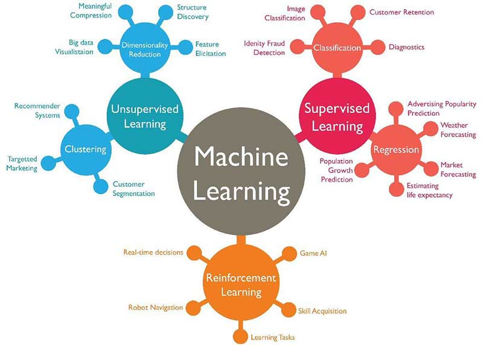

# EMERGING TECHNOLOGIES

## Basic Requirement for Software Engineers 

- Software Industry Knowledge 

- Recommended Skills, Knowledge, do's and don'ts

### Usefull links

- https://github.com
- https://www.hackerrank.com/
- https://www.hackerearth.com/
- https://www.kaggle.com/
- https://colab.research.google.com/notebooks/intro.ipynb#recent=true
- https://www.techgig.com/
- https://www.geeksforgeeks.org/

## What is Machine Learning ?

- Provide system's the ability to automatically learn and improve from experience without being explicitly programmed
- Eg: Imagine you are going to bowling and its your first day
- A computer program is said to learn from experience E with respect to some class of tasks T and performance measure P, if its performance at tasks in T, as measured by P, improves with experience E.

### Difference between ML & AI
- Artificial Intelligence is the broader concept of machines being able to carry out tasks in a 
way that we would consider “smart”.
- Machine Learning is a current application of AI based on the idea of feeding data & allow 
them learn for themselves

### Types of ML

- Supervised ML:
    Supervised learning is where you have input variables (x) and an output variable (Y) and you use an algorithm to learn the mapping function from the input to the output Y = f(X)

    

- Reinforcement learning:
    A computer program interacts with a dynamic environment in which it must perform a certain goal (such as driving a vehicle or playing a game against an opponent). The program is provided feedback in terms of rewards and punishments as it navigates its problem space. Eg: autonomous driving, text summarization, question answering, and machine translation

- Semi-supervised learning:
    Problems where you have a large amount of input data and only some of the data is labeled, are called semi-supervised learning problems. Eg: photo archive where only some of the images are labeled

- Unsupervised machine learning:
    System is given a set data and tasked with finding patterns and correlations or relationships

### Applications of ML & AI

- Do you know Facebook is using ML to tag your friends in your uploaded picture? Do you know Facebook shows custom video recommendations based on your interest history?
- Do you know how does gmail knows that a particular mail has to go to priority, social, promotion or spam box
- Healthcare - Medication predictions, disease identification or trajectory etc
- Businesses - efficiency of logistics and transportation networks, build customer profiles, increase sales and improve brand loyalty
- Education - Identify struggling students earlier and take necessary action 

## =================================================

## BlockChain

Blockchain is a specific type of database.
It differs from a typical database in the way it stores information; A blockchain collects information together in groups, also known as blocks, that hold sets of information. Blocks have certain storage capacities and, when filled, are chained onto the previously filled block, forming a chain of data known as the “blockchain.” All new information that follows that freshly added block is compiled into a newly formed block that will then also be added to the chain once filled. This makes the data chained together in chronological order.

Different types of information can be stored on a blockchain but the most common use so far has been as a ledger for transactions. 
In Bitcoin’s case, blockchain is used in a decentralized way so that no single person or group has control—rather, all users collectively retain control.
Decentralized blockchains are immutable, which means that the data entered is irreversible. For Bitcoin, this means that transactions are permanently recorded and viewable to anyone.

### Decentralization

For the purpose of understanding blockchain, lets see how it has been implemented by Bitcoin. Like a database, Bitcoin needs a collection of computers to store its blockchain. For Bitcoin, this blockchain is just a specific type of database that stores every Bitcoin transaction ever made. In Bitcoin’s case, and unlike most databases, these computers are not all under one roof, and each computer or group of computers is operated by a unique individual or group of individuals across the world. These computers that makeup Bitcoin’s network are called nodes. 

In a blockchain, each node has a full record of the data that has been stored on the blockchain since its inception. For Bitcoin, the data is the entire history of all Bitcoin transactions. If one node has an error in its data it can use the thousands of other nodes as a reference point to correct itself. This way, no one node within the network can alter information held within it. Because of this, the history of transactions in each block that make up Bitcoin’s blockchain is irreversible. 

If one user tampers with Bitcoin’s record of transactions, all other nodes would cross-reference each other and easily pinpoint the node with the incorrect information. This system helps to establish an exact and transparent order of events.

### Transparency
Because of the decentralized nature of Bitcoin’s blockchain, all transactions can be transparently viewed by either having a personal node or by using <a href='https://www.blockchain.com/explorer?utm_campaign=dcomnav_explorer'>blockchain explorers</a> that allow anyone to see transactions occurring live.

After a block has been added to the end of the blockchain, it is very difficult to go back and alter the contents of the block unless the majority reached a consensus to do so. That’s because each block contains its own hash, along with the hash of the block before it, as well as the previously mentioned time stamp

The goal of blockchain is to allow digital information to be recorded and distributed, but not edited. 

### BitCoin Mining
When someone sends bitcoin anywhere, it's called a transaction. Transactions made in-store or online are documented by banks, point-of-sale systems, and physical receipts. Bitcoin miners achieve the same thing by grouping transactions together in “blocks” and adding them to a public record called the “blockchain.” Nodes then maintain records of those blocks so that they can be verified into the future. When bitcoin miners add a new block of transactions to the blockchain, part of their job is to make sure that those transactions are accurate. In particular, bitcoin miners make sure that bitcoin is not being duplicated. 

As compensation for their efforts, miners are awarded bitcoin whenever they add a new block of transactions to the blockchain.
Miners will be rewarded with fees for processing transactions that network users will pay. These fees ensure that miners still have the incentive to mine and keep the network going.

#### Verifying Bitcoin Transactions
In order for bitcoin miners to actually earn bitcoin from verifying transactions, two things have to occur. First, they must verify one megabyte (MB) worth of transactions. Second, in order to add a block of transactions to the blockchain, miners must solve a complex computational math problem, also called a "proof of work." What they're actually doing is trying to come up with a 64-digit hexadecimal number, called a "hash," that is less than or equal to the target hash.

### Applications 
- Banking and Finance, banks also have the opportunity to exchange funds between institutions more quickly and securely
- In the stock trading business, for example, the settlement and clearing process can take up to three days
- Health care providers can leverage blockchain to securely store their patients’ medical records.
- Maintaining Records of Property
- Supply Chains

